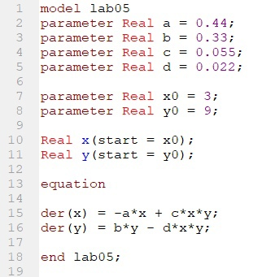
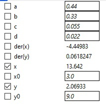
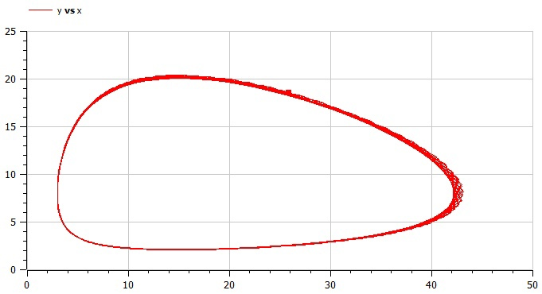
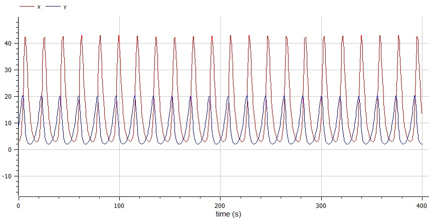
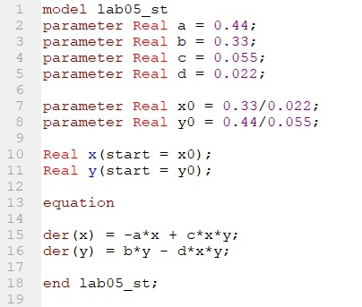
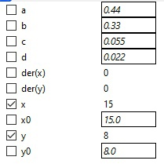
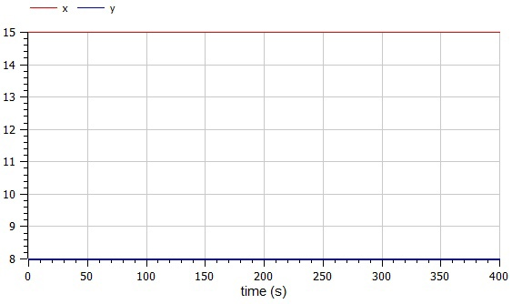

---
# Front matter
title: "Отчет по лабораторной работе №5"
subtitle: "Модель хищник-жертва"
author: "Бурдина Ксения Павловна"
group: NFIbd-01-19
institute: RUDN University, Moscow, Russian Federation
date: 2022 Mar 08th

# Generic otions
lang: ru-RU
toc-title: "Содержание"

# Bibliography
csl: pandoc/csl/gost-r-7-0-5-2008-numeric.csl

# Pdf output format
toc: true # Table of contents
toc_depth: 2
lof: true # List of figures
lot: true # List of tables
fontsize: 12pt
linestretch: 1.5
papersize: a4
documentclass: scrreprt
### Fonts
mainfont: PT Serif
romanfont: PT Serif
sansfont: PT Sans
monofont: PT Mono
mainfontoptions: Ligatures=TeX
romanfontoptions: Ligatures=TeX
sansfontoptions: Ligatures=TeX,Scale=MatchLowercase
monofontoptions: Scale=MatchLowercase,Scale=0.9
## Biblatex
biblatex: true
biblio-style: "gost-numeric"
biblatexoptions:
  - parentracker=true
  - backend=biber
  - hyperref=auto
  - language=auto
  - autolang=other*
  - citestyle=gost-numeric
## Misc options
indent: true
header-includes:
  - \linepenalty=10 # the penalty added to the badness of each line within a paragraph (no associated penalty node) Increasing the value makes tex try to have fewer lines in the paragraph.
  - \interlinepenalty=0 # value of the penalty (node) added after each line of a paragraph.
  - \hyphenpenalty=50 # the penalty for line breaking at an automatically inserted hyphen
  - \exhyphenpenalty=50 # the penalty for line breaking at an explicit hyphen
  - \binoppenalty=700 # the penalty for breaking a line at a binary operator
  - \relpenalty=500 # the penalty for breaking a line at a relation
  - \clubpenalty=150 # extra penalty for breaking after first line of a paragraph
  - \widowpenalty=150 # extra penalty for breaking before last line of a paragraph
  - \displaywidowpenalty=50 # extra penalty for breaking before last line before a display math
  - \brokenpenalty=100 # extra penalty for page breaking after a hyphenated line
  - \predisplaypenalty=10000 # penalty for breaking before a display
  - \postdisplaypenalty=0 # penalty for breaking after a display
  - \floatingpenalty = 20000 # penalty for splitting an insertion (can only be split footnote in standard LaTeX)
  - \raggedbottom # or \flushbottom
  - \usepackage{float} # keep figures where there are in the text
  - \floatplacement{figure}{H} # keep figures where there are in the text
---

# Цель работы

Целью данной работы является построение математической модели Лотки-Вольтерры "хищник-жертва" на примере задачи о зависимости численности волков от численности зайцев.

# Задание

В ходе работы необходимо:

1. Прописать уравнения для построения модели изменения численности популяции хищников и жертв при условии, что $x_0 = 3$, $y_0 = 9$.

2. Построить график зависимости численности хищников от численности жертв и графики изменения численности хищников и численности жертв при заданных начальных условиях.

3. Найти стационарное состояние заданной системы.

# Теоретическое введение

Постановка задачи следующая:

В лесу проживают $x$ волков, питающихся зайцами, число которых в этом же лесу $у$. Пока число зайцев достаточно велико для прокормки всех волков, численность волков растет до тех пор, пока не наступит момент, что корма перестанет хватать на всех. Тогда волки начнут умирать, и их численность будет уменьшаться. В этом случае в какой-то момент времени численность зайцев снова начнет увеличиваться, что повлечет за собой новый рост популяции волков. Такой цикл будет повторяться, пока обе популяции будут существовать. Помимо этого, на численность стаи влияют болезни и старение.

Решение исходной задачи сводится к решению системы дифференциальных уравнений: 

$$\left\{ 
\begin{array}{c}
\frac{dx}{dt} = -0.44x(t)+0.055x(t)y(t) \\ 
\frac{dy}{dt} = 0.33y(t)-0.022x(t)y(t) \\ 
\end{array}
\right.$$
с начальными условиями:
$$\left\{ 
\begin{array}{c}
x_0 = 3 \\ 
y_0 = 9 \\ 
\end{array}
\right.$$

# Выполнение лабораторной работы

1. Рассмотрим модель взаимодействия двух видов типа «хищник — жертва» - модель Лотки-Вольтерры. Данная двувидовая модель основывается на следующих предположениях:
- Численность популяции жертв $x$ и хищников $y$ зависит только от времени;
- В отсутствии взаимодействия численность видов изменяется по модели Мальтуса, при этом число жертв увеличивается, а число хищников падает;
- Естественная смертность жертвы и естественная рождаемость хищника считаются несущественными;
- Эффект насыщения численности обеих популяций не учитывается;
- Скорость роста численности жертв уменьшается пропорционально численности хищников.
 
2. Определим уравнения, описывающие изменение численности жертв и хищников [[1]](https://esystem.rudn.ru/pluginfile.php/1343893/mod_resource/content/2/%D0%9B%D0%B0%D0%B1%D0%BE%D1%80%D0%B0%D1%82%D0%BE%D1%80%D0%BD%D0%B0%D1%8F%20%D1%80%D0%B0%D0%B1%D0%BE%D1%82%D0%B0%20%E2%84%96%204.pdf). Оно имеет следующий вид: $$\frac{dx}{dt} = ax(t)-bx(t)y(t)$$ $$\frac{dy}{dt} = -cy(t)+dx(t)y(t)$$
где $x$ - число жертв, $y$ - число хищников.
  
    В данной системе коэффициент $a$ описывает скорость естественного прироста числа жертв в отсутствие хищников, $c$ - естественное вымирание хищников, лишенных пищи в виде жертв. Вероятность взаимодействия жертвы и хищника считается пропорциональной как количеству жертв, так и числу самих хищников $(xy)$. Каждый акт взаимодействия уменьшает популяцию жертв, но способствует увеличению популяции хищников (члены $-bxy$ и $dxy$ в правой части уравнения).

3. Заметим, что у нас имеет место на существование стационарное состояние системы, то есть положение равновесия, не зависящее от времени решения. Оно будет находиться в точке: $$x_0 = \frac{c}{d}$$ $$y_0 = \frac{a}{b}$$
где $x(0) = x_0$, $y(0) = y_0$.
В стационарном состоянии в любой момент времени численность популяций изменяться не будет.

4. Напишем программу для расчёта изменения численности популяции хищников и жертв в OpenModelica. Зададим начальное состояние системы $x_0 = 3$ и $y_0 = 9$. Далее запишем параметры для решения системы: $$a = 0.44, b = 0.055, c = 0.33, d = 0.022$$
Установим, что переменные $x, y$ имеют начальные значения $x_0, y_0$ соответственно. Запишем уравнения, описывающие нашу модель: $$der(x) = -a*x + c*x*y$$ $$der(y) = b*y - d*x*y$$

{width=70%}

{width=80%}

  В результате выполнения данной программы получаем следующий график зависимости численности хищников от численности жертв:
  
  

  Также можем увидеть график изменения чиселнности хищников и численности жертв со временем:
  
  

5. Напишем программу для нахождения стационарного графика системы. Параметры для решения системы остаются теми же. Начальное состояние системы мы изменяем, опираясь на формулы из теории: $$x_0 = \frac{c}{d} = \frac{0.33}{0.022}$$ $$y_0 = \frac{a}{b} = \frac{0.44}{0.055}$$
Установим, что переменные $x, y$ имеют начальные значения $x_0, y_0$ соответственно. Уравнения, описывающие нашу модель, остаются прежними: $$der(x) = -a*x + c*x*y$$ $$der(y) = b*y - d*x*y$$

{width=70%}

{width=80%}

  В результате выполнения данной программы получаем следующий график численности хищников и численности жертв:
  
  

# Выводы

В процессе выполнения работы мы построили модель Лотки-Вольтерры "хищник-жертва" на примере задачи о зависимости численности волков от численности зайцев. Получили дифференциальные уравнения для построения модели с учетом начального состояния системы. Построили график зависимости численности хищников от численности жертв. Нашли зависимость изменения численности популяций от времени, а также стационарное состояние системы.

# Список литературы

1. Методические материалы курса "Математическое моделирование".

2. Модель "хищник-жертва". Электронный справочник: [https://spravochnick.ru/informacionnye_tehnologii/informacionnye_modeli_i_modelirovanie/model_hischnik-zhertva/].
